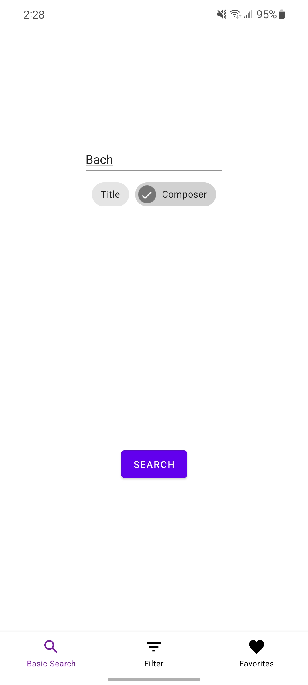
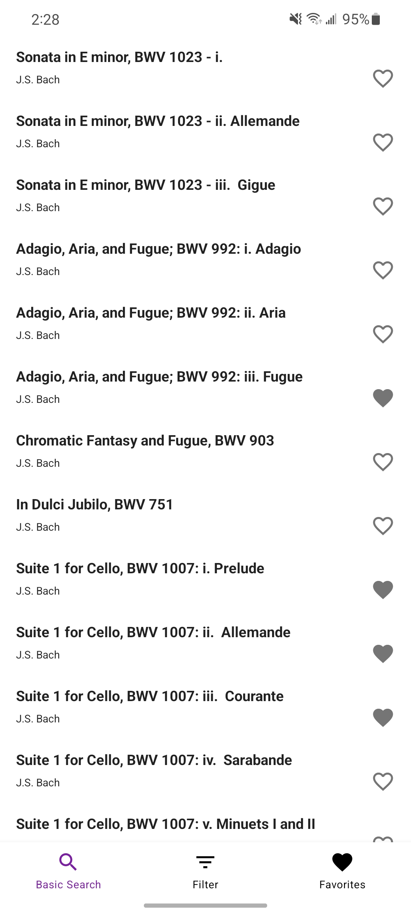
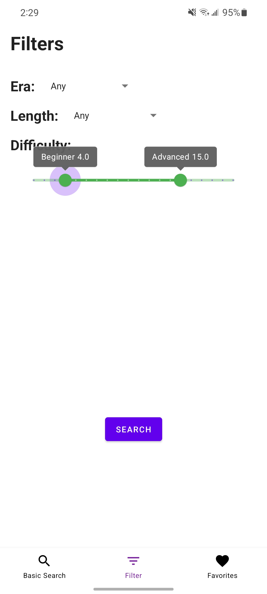
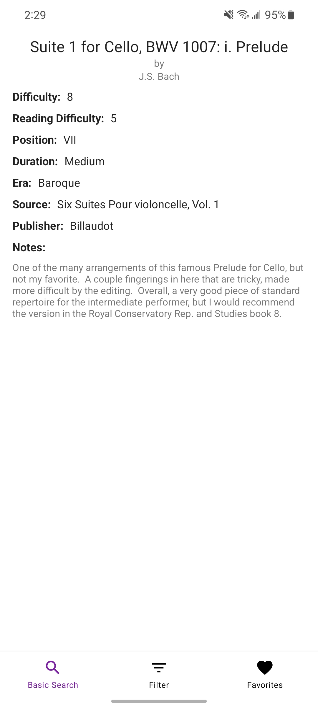

# Guitarburst
Guitarburst Android App

https://www.guitarburst.com/ is a site which shows the difficulty of classical guitar pieces. This application is the mobile version of this site.

Screenshots:

  
   

  
  

